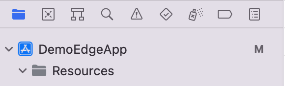

# Add Currency Plugins

Now things are getting more fun. Let's add some cryptocurrencies to our app.

Since major cryptos exist on Bitcoin and Ethereum blockchains, we need first install packages related to both:

```
yarn add edge-currency-accountbased edge-currency-plugins core-js
```

Note that `edge-currency-accountbased` is a package for the Ethereum ecosystem, the other is for Bitcoin.

We want to include all the standard library features from the client side to Node. [`core-js`](https://www.npmjs.com/package/core-js) polyfills for ECMAScript up to 2019. It gives us the necessary basic tools like promises, typed arrays, iterators, etc.

## Edge Pack
We need to shove the content of these two plugins to our native folders so that iOS and Android devices can use them on-premise. To do that, we need to webpack both plugins to a single bundled file, and put that file to the respective folders for iOS and Android.

Webpacking can be time-consuming to configure. Luckily, we have an in-house solution that helps minimize configs needed.

```
yarn add edge-pack babel-loader
```

[`edge-pack`](https://github.com/EdgeApp/edge-pack) is a CLI tool that bundles currency plugins and outputs a bundled file to the Android directory (at this point, it's still manual on the iOS side. We will get to that in a bit).

We need [`babel-loader`](https://www.npmjs.com/package/babel-loader) to help with webpacking.

To tell `edge-pack` what configs and plugins to bundle, let's create a `pluginEntry.js` under `src/`. Inside the file, paste the below:

```js
// WebPack bundles this thing up to give us our core plugins.
import "core-js"
// Bitcoin related currencies
import 'edge-currency-accountbased'
// Ethereum related currencies
import { setMemletConfig } from 'edge-currency-plugins'

setMemletConfig({
  maxMemoryUsage: 50 * 1024 * 1024 // 50MB
})
```


<details>
  <summary>Explain to me what's going on in that file...</summary>

  We want to include all the standard library features from the client side to Node. [`core-js`](https://www.npmjs.com/package/core-js) polyfills for ECMAScript up to 2019. It gives us the necessary basic tools like promises, typed arrays, iterators, etc.

  Then, we imported the Ethereum plugin. Nothing fancy here.

  For the Bitcoin plugin, however, we do have the option to do some additional configs. For the above example, we had set the `maxMemoryUsage` for the Ethereum plugin.
</details>

At this point, we can simply run the below commandline command to bundle our plugins"

```
yarn edge-pack src/pluginEntry.js
```

## Linking Bundle Files to iOS

If you have successfully completed the steps up to this point, you will see that `plugin-bundle.js` and `plugin-bundle.js.map` have been created under `android/app/src/main/assets/edge-core/`.

Now, open Xcode, and open the current project (`ios/YourAppName.xcworkspace`).

Then, create a folder named `Resources` under the root directory of your Xcode project.



Next, drag the `edge-core` folder from the above-mentioned Android path, and drop it under the `Resources` folder in Xcode. There will be a pop-up window with some options. Make sure you have `Copy folder references` selected. Then click "Finish".

So, Xcode just created a pointer to the files under the Android's `edge-core` folder. Once this link is established, we can make whatever modification we want to files in the Android path, and not to do duplicated steps for the iOS because Xcode will simply mirror those files.

## UI

To enable currencies for our app to consume, we need to head to our `src/App.tsx`, and add the two following props to the `<MakeEdgeContext />` component:

```js
pluginUris={['edge-core/plugin-bundle.js']}
plugins={{ethereum: true, bitcoin: true}}
```

The `pluginUris` simply tells the program where to look for the bundled plugins file, and `plugins` give you the options to enable certain cryptocurrencies. In this example, we have enabled Bitcoin and Ethereum.

To visually see if things are working, we head to `src/MainUI.tsx`, and put the following in the `MainUI` function:

```js
// We expect to have an Ethereum wallet in the account:
const walletInfo = edgeAccount.getFirstWalletInfo('wallet:bitcoin')

// Create an Ethereum wallet at login if we don't have one:
React.useEffect(() => {
  if (walletInfo == null)
    edgeAccount.createCurrencyWallet('wallet:bitcoin', {
      name: 'My First Bitcoin Wallet',
      fiatCurrencyCode: 'iso:USD'
    })
}, [edgeAccount])

// Watch the list of loaded wallets.
// Wallets begin loading after the login is complete,
// so it always takes time for our wallet to appear:
const [wallets, setWallets] = React.useState(edgeAccount.currencyWallets)
React.useEffect(
  () => edgeAccount.watch('currencyWallets', setWallets),
  [edgeAccount]
)

// Find our wallet in the list (might not be there at first):
const wallet = walletInfo == null ? undefined : wallets[walletInfo.id]
```
And change the return statement to:
```js
return (
  <SafeAreaView style={{ alignItems: 'center' }}>
    <Text>Username: {edgeAccount.username}</Text>
    <Text>Wallet name: {wallet?.name}</Text>
    <Text>Wallet Balance: {wallet?.balances?.BTC}</Text>
    <Button title="Log Out" onPress={onLogout} />
  </SafeAreaView>
)
```

What everything above does is to create a wallet named "My First Wallet", if there's no Bitcoin wallet associated with the user.

Feel free to change "bitcoin" to "ethereum" to test out if things work for Ethereum. Note, you'd also need to change the currency code in the return statement (change `wallet?.balances?.BTC` to `wallet?.balances?.ETH`).

## Other Tips
At this point, it might be helpful to include a script like `"prepare.ios": "(cd ios && pod install)",` to your `package.json` to speed up your development.

If you plan to run `edge-pack` frequently, feel free to include a custom script for it as well.
