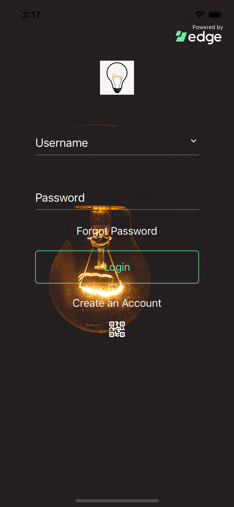

# Customize Login UI

The `LoginScreen` has a couple of props that allow you to customize the UI for branding purposes.

These props are:
```js
appId: String,
appName: String,
backgroundImage,
landingScreenText: String,
parentButton: JSXElement,
primaryLogo,
primaryLogoCallback
```

Note that `backgroundImage`, `primaryLogo` and `primaryLogoCallback` usually take a relative path to your picture assets.

## Example
Here is an example usage:
```js
<LoginScreen
  appId='com.mydomain.myapp'
  appName='My App'
  landingScreenText='Welcome to My App'
  backgroundImage={require('../assets/app-background.jpg')}
  primaryLogo={require('../assets/app-logo.png')}
  accountOptions={{}}
  context={edgeContext}
  onLogin={setEdgeAccount}
/>
```
Now, our app looks like this:



